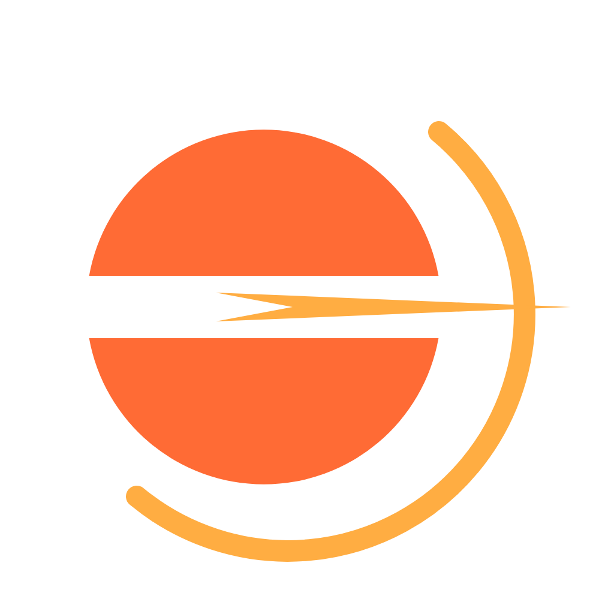
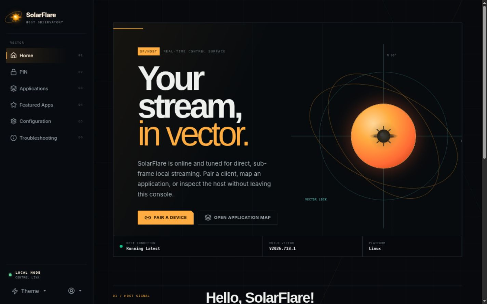
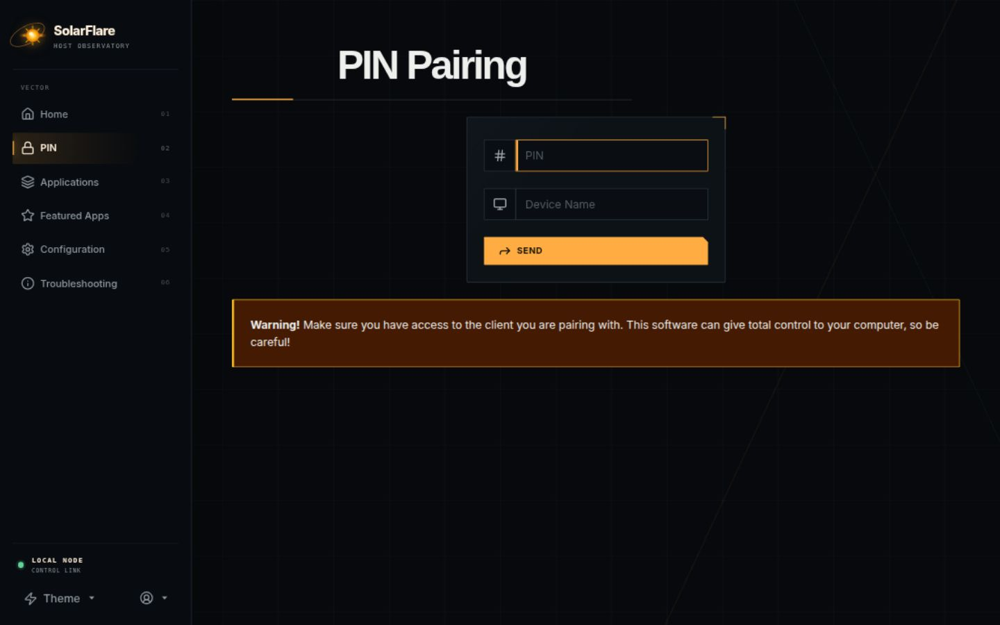
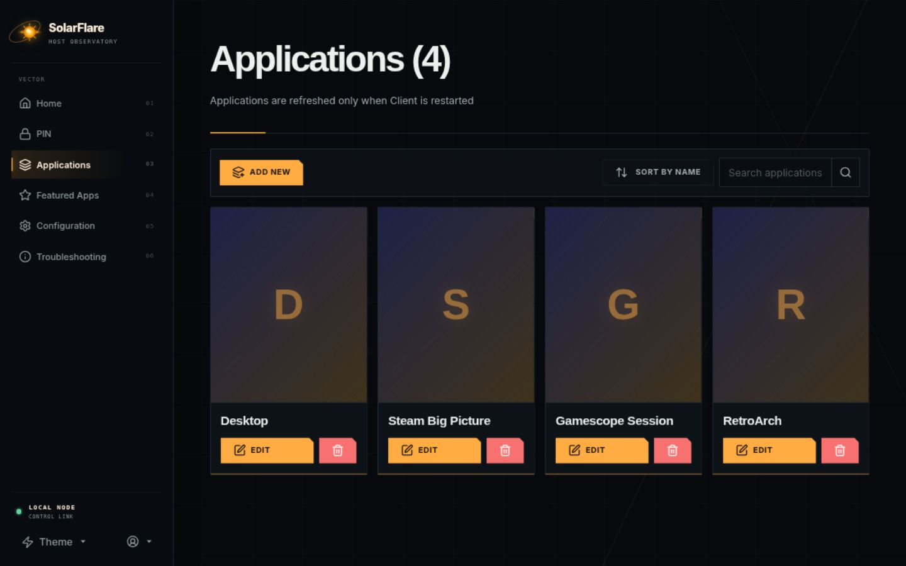
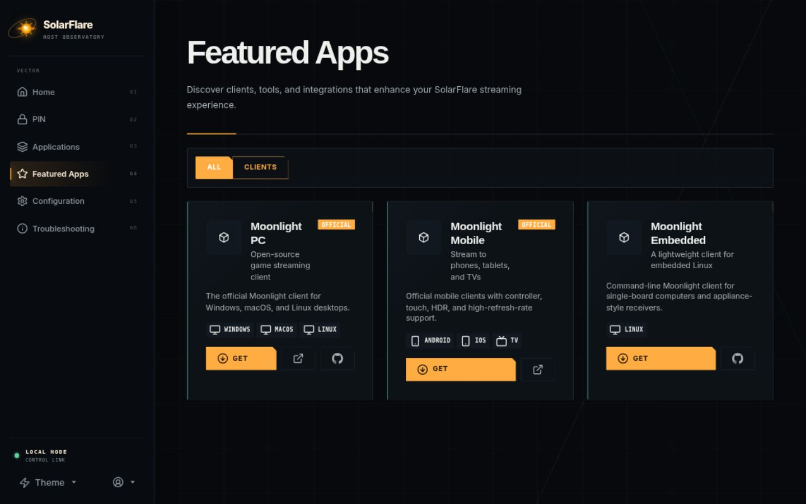
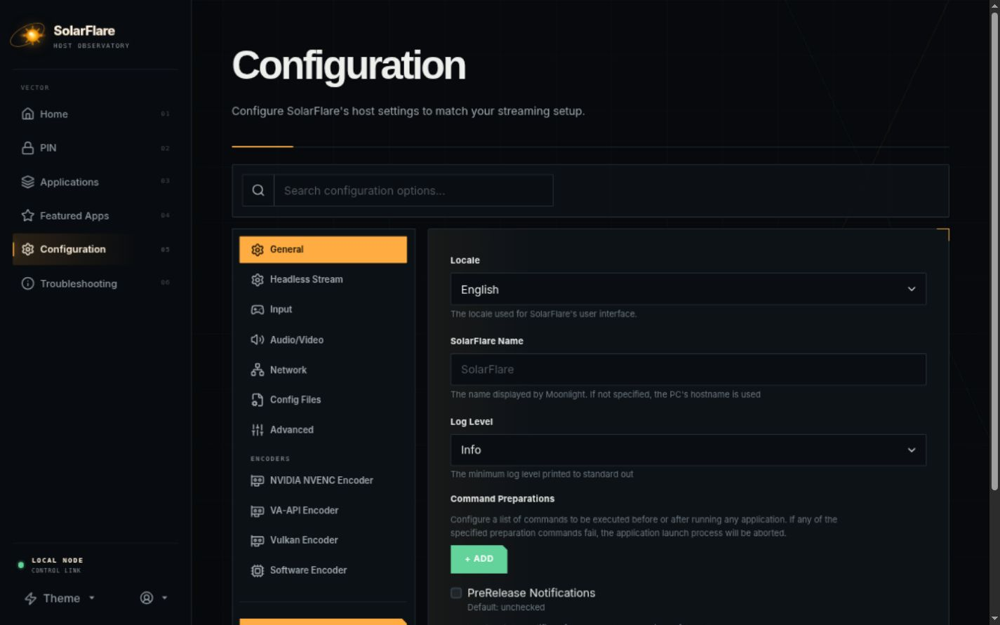
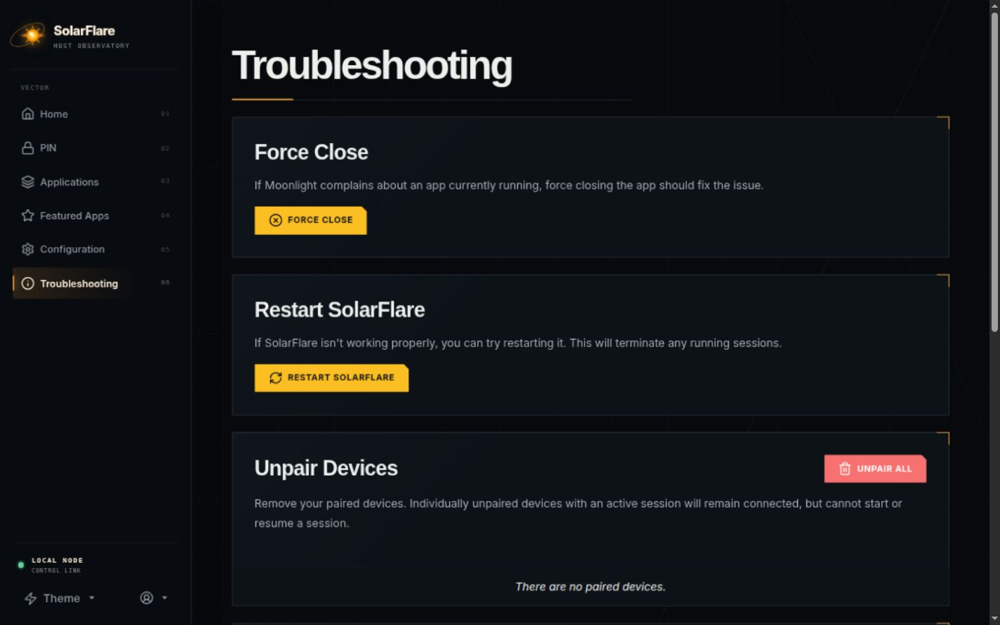
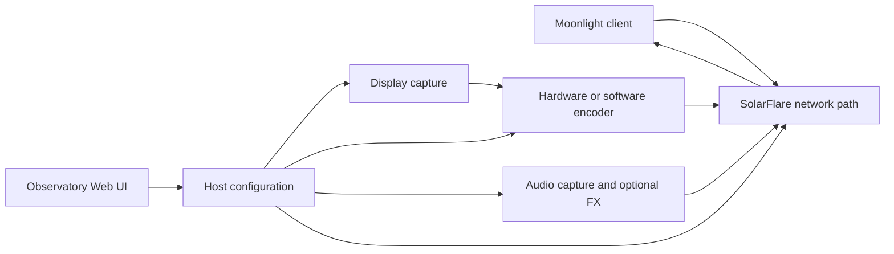

<div align="center">
  
  <h1>SolarFlare</h1>
  <p><strong>A game-streaming host for Moonlight.</strong></p>
  <p>Linux and AMD-first capture, transport, and host control tuned for predictable local-network latency.</p>

  <p>
    <a href="https://github.com/vindeckyy/Solar-Flare/releases/latest"></a>
    <a href="LICENSE"></a>
    <a href="https://moonlight-stream.org/"></a>
    
  </p>

  <p>
    <a href="https://vindeckyy.github.io/Solar-Flare/">Website</a> ·
    <a href="#install">Install</a> ·
    <a href="#control-surface">Interface</a> ·
    <a href="#performance-architecture">Architecture</a> ·
    <a href="#configuration">Configuration</a> ·
    <a href="#build-and-test">Build</a> ·
    <a href="docs/CHANGELOG-SolarFlare.md">Changelog</a>
  </p>
</div>



---

## Overview

SolarFlare is a self-hosted game-streaming server for Moonlight clients. It
combines a low-latency Linux data path with an original observatory-style Web
UI for pairing devices, managing applications, tuning the host, and diagnosing
the complete streaming pipeline.

| | |
|---|---|
| **Primary use** | High-quality game and desktop streaming across a trusted local network |
| **Host focus** | Linux x86-64, with native tuning for modern AMD and Intel CPUs |
| **Client protocol** | Moonlight / NVIDIA GameStream-compatible transport |
| **Control plane** | Responsive HTTPS interface at `https://localhost:47990` |
| **Current release** | [`v1.0.7`](https://github.com/vindeckyy/Solar-Flare/releases/latest) |
| **Build tag** | [`v2026.726.1-solarflare`](https://github.com/vindeckyy/Solar-Flare/releases/tag/v2026.726.1-solarflare) |

> [!IMPORTANT]
> SolarFlare preserves the executable name, service identifier, ports, state
> format, and configuration directory used by Sunshine so existing Moonlight
> pairings remain compatible. User-facing product identity is SolarFlare;
> compatibility identifiers such as `sunshine`, `SUNSHINE_CLIENT_*`, and
> `~/.config/sunshine` intentionally remain unchanged.

## Fork additions

| System | SolarFlare approach |
|---|---|
| **Host control** | An observatory interface with persistent desktop navigation, compact mobile controls, command search, and unified diagnostics |
| **Network path** | Link-aware pacing, optional busy polling, expanded ENet buffers, DSCP tagging, and adaptive bitrate controls |
| **Scheduling** | Capture-thread affinity, controlled real-time scheduling, native CPU tuning, and optional boot-time performance services |
| **Video** | NVENC tuning profiles, per-application encoder overrides, headless display paths, and hardware-aware capture selection |
| **Audio** | Low-latency PipeWire hints plus optional AGC, voice activity detection, ducking, noise gating, and Opus controls |
| **Operations** | Scoped API tokens, trusted-subnet pairing, local client catalog, structured logs, and focused regression coverage |

SolarFlare exposes these capabilities as individual controls. Defaults are
chosen for compatibility, and each tuning path can be disabled independently
when comparing behavior on a particular host.

## Control surface

The interface is built as a host instrument panel. Motion is reserved for
interaction and state changes; there are no ambient looping effects.

<table>
  <tr>
    <td width="50%"><strong>Pair a client</strong><br><sub>Focused PIN entry with clear host state.</sub><br><br></td>
    <td width="50%"><strong>Manage applications</strong><br><sub>Launch definitions, artwork, and import tools.</sub><br><br></td>
  </tr>
  <tr>
    <td width="50%"><strong>Discover clients</strong><br><sub>A local catalog with no third-party runtime fetch.</sub><br><br></td>
    <td width="50%"><strong>Tune the host</strong><br><sub>Dense configuration surfaces with consistent hierarchy.</sub><br><br></td>
  </tr>
  <tr>
    <td width="50%"><strong>Inspect the pipeline</strong><br><sub>Logs, diagnostics, and recovery actions in one place.</sub><br><br></td>
    <td width="50%"><strong>Monitor the host</strong><br><sub>Connection state, release status, and direct actions.</sub><br><br></td>
  </tr>
</table>

## Performance architecture



The fork-specific path is concentrated in four areas:

1. **Capture:** X11, KMS, PipeWire/portal, headless compositor, and optional
   Hermes-KMS paths are selected according to the build and host environment.
2. **Encode:** NVENC presets and per-application overrides tune latency,
   lookahead, adaptive quantization, and frame structure without changing the
   Moonlight protocol.
3. **Transport:** Link-speed detection, pacing, socket buffers, busy polling,
   QoS marking, and adaptive bitrate respond to local-network conditions.
4. **Control:** The HTTPS UI, API scopes, pairing rules, and diagnostics expose
   host state without placing cloud services in the streaming path.

See [SolarFlare configuration](docs/CONFIGURATION.md) for fork controls and the
[complete configuration reference](docs/configuration.md) for inherited host
options.

## Install

### Supported release profile

SolarFlare v1.0.7 publishes three Linux x86-64 files:

| Asset | Purpose |
|---|---|
| `sunshine-x86_64` | Stripped executable for updating an existing installation |
| `solarflare-linux-x86_64.tar.gz` | Executable plus matching runtime and Web UI assets |
| `SHA256SUMS` | SHA-256 checksums for both downloads |

The `sunshine-x86_64` compatibility filename is intentional. SolarFlare keeps
the executable and service names expected by existing Sunshine installations
and Moonlight pairings. A fresh machine should use the source installer so the
Web UI, desktop files, shaders, udev rules, and service unit are installed with
the binary.

The source tree retains inherited cross-platform code, but the SolarFlare
release and performance profile documented here are maintained for Linux.

### Fresh source installation

```bash
git clone --recursive https://github.com/vindeckyy/Solar-Flare.git
cd Solar-Flare
./scripts/linux-install.sh
systemctl --user enable --now app-dev.lizardbyte.app.Sunshine.service
```

The installer detects Arch/CachyOS, Debian/Ubuntu, Fedora-family, openSUSE,
Bazzite, and NixOS hosts. On NixOS it enters the repository's reproducible
Nix shell and installs into `~/.local`. Read the
[porting guide](docs/PORTING.md) for the required declarative host settings
or before using an unsupported distribution.

`scripts/linux-install.sh` is the maintained SolarFlare path.
`scripts/linux_build.sh` is the inherited upstream Docker/CI builder and is
not required for normal installs. `scripts/cachyos-build.sh` remains as a
compatibility wrapper that forwards to `linux-install.sh`.

### Update an existing installation with the release binary

```bash
systemctl --user stop app-dev.lizardbyte.app.Sunshine.service
sudo curl --fail --location \
  --output /usr/local/bin/sunshine \
  https://github.com/vindeckyy/Solar-Flare/releases/latest/download/sunshine-x86_64
sudo chmod 0755 /usr/local/bin/sunshine
sudo setcap 'cap_sys_admin,cap_sys_nice+p' /usr/local/bin/sunshine
systemctl --user start app-dev.lizardbyte.app.Sunshine.service
```

Then open `https://localhost:47990`, accept the host-local certificate, and
pair a [Moonlight](https://moonlight-stream.org/) client using its PIN.

### Verify the host

```bash
systemctl --user --no-pager status app-dev.lizardbyte.app.Sunshine.service
getcap /usr/local/bin/sunshine
journalctl --user -u app-dev.lizardbyte.app.Sunshine.service -n 50 --no-pager
curl --insecure --output /dev/null --write-out '%{http_code}\n' \
  https://localhost:47990/
```

An unauthenticated `curl` request should return `401`; the browser login page
becomes available after credentials are configured.

## Configuration

Configuration remains at `~/.config/sunshine/sunshine.conf`, with application
definitions in `~/.config/sunshine/apps.json`.

| Area | Representative controls | Documentation |
|---|---|---|
| Network | `busy_poll_us`, `rate_cap_pct`, `enet_4mib_buffer`, `dscp_qos` | [Fork controls](docs/CONFIGURATION.md#the-tunables-at-a-glance) |
| Scheduling | `cpu_pinning`, `gpu_governor` | [Scheduling behavior](docs/CONFIGURATION.md#cpu_pinning) |
| Capture | `headless_virtual_display`, `skip_wayland_correlation` | [Capture controls](docs/CONFIGURATION.md#headless_virtual_display) |
| Latency | `latency_mode` (`safe` / `aggressive`) | [Latency mode](docs/CONFIGURATION.md#latency_mode) |
| Video | `nvenc_tuning_preset`, adaptive bitrate, codec and quality controls | [Complete reference](docs/configuration.md) |
| Audio | `pipewire_latency_ms`, `sf_audio_*`, `sf_opus_*` | [Audio FX](docs/CONFIGURATION.md#audio-fx-pre-encoder-processing) |
| Access | Scoped API tokens, trusted subnets, pairing, origin policy | [API](docs/api.md) · [Security](SECURITY.md) |

For a minimal per-application encoder override:

```json
{
  "name": "Competitive profile",
  "cmd": "steam steam://rungameid/730",
  "encoder-preset": 0
}
```

Preset values are `-1` for the host default, `0` for latency, `1` for
balanced, and `2` for quality.

## Build and test

The project uses CMake, Ninja, Vite, and GoogleTest. Keep build directories
under the `cmake-build-` prefix.

```bash
git submodule update --init --recursive

cmake -S . -B cmake-build-release -G Ninja \
  -DCMAKE_BUILD_TYPE=Release \
  -DBUILD_DOCS=OFF \
  -DBUILD_TESTS=OFF
cmake --build cmake-build-release --target sunshine web-ui -j2
```

To run the test suite:

```bash
cmake -S . -B cmake-build-tests -G Ninja \
  -DCMAKE_BUILD_TYPE=Debug \
  -DBUILD_TESTS=ON \
  -DBUILD_DOCS=OFF
cmake --build cmake-build-tests --target test_sunshine -j2
./cmake-build-tests/tests/test_sunshine --gtest_brief=1
```

Platform-specific dependencies and compiler requirements are documented in
[Building](docs/building.md) and [Porting SolarFlare](docs/PORTING.md).

## Repository map

| Path | Purpose |
|---|---|
| `src/` | Streaming host, transport, capture, encode, audio, and configuration |
| `src_assets/common/assets/web/` | SolarFlare observatory interface |
| `tests/` | Unit, integration, regression, and documentation contracts |
| `packaging/` | Platform packaging and optional Linux performance services |
| `scripts/` | Linux installer, release, screenshot, and maintenance tooling |
| `docs/` | User, operator, developer, and inherited configuration references |

## Documentation

| Document | Use it for |
|---|---|
| [Getting started](docs/getting_started.md) | Inherited platform background and client prerequisites |
| [SolarFlare configuration](docs/CONFIGURATION.md) | Fork-specific network, scheduling, audio, and capture controls |
| [Complete configuration](docs/configuration.md) | Every inherited host option |
| [Porting](docs/PORTING.md) | Distribution packages, toolchains, and manual builds |
| [Troubleshooting](docs/troubleshooting.md) | Capture, encoder, audio, networking, and input diagnostics |
| [API](docs/api.md) | Automation and scoped host access |
| [Security](SECURITY.md) | Supported versions and private vulnerability reporting |
| [SolarFlare changelog](docs/CHANGELOG-SolarFlare.md) | Fork release and implementation history |

## Project policy

- **Security:** report SolarFlare-specific vulnerabilities privately through
  [GitHub Security Advisories](https://github.com/vindeckyy/Solar-Flare/security/advisories/new).
- **Contributions:** read [CONTRIBUTING.md](CONTRIBUTING.md) and the
  [development guide](docs/contributing.md) before opening changes.
- **License:** SolarFlare is distributed under
  [GPL-3.0-only](LICENSE).
- **Upstream:** the GameStream foundation and inherited platform work come
  from [LizardByte/Sunshine](https://github.com/LizardByte/Sunshine). Internal
  compatibility names are retained where changing them would break clients,
  configuration, packaging, or update paths.
- **Acknowledgment:** SolarFlare's Linux capture, compositor, and stream-health
  design was informed by reviewing [papi-ux/polaris](https://github.com/papi-ux/polaris).
  We appreciate the work from its contributors. SolarFlare remains a
  Sunshine-derived project, and this acknowledgment distinguishes design
  inspiration from incorporated source code.

---

<div align="center">
  <strong>SolarFlare</strong><br>
  <sub>Self-hosted streaming on your LAN. No cloud in the path.</sub>
</div>
